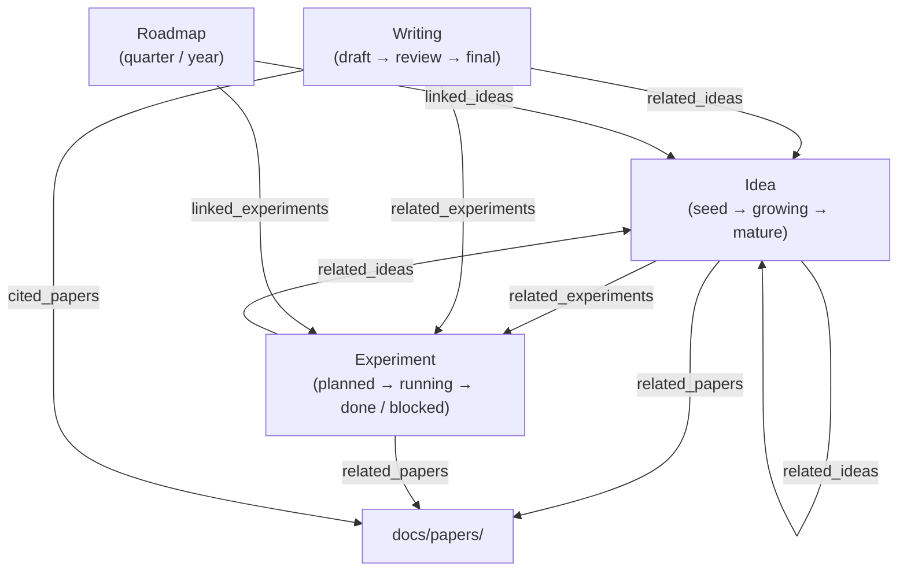

# Workflow Data Architecture

> DPR 研究工作流数据模型 —— 对照现有 library/ paper-note 模式设计。

本文档定义 Idea / Experiment / Writing / Roadmap 四个核心实体的类型系统与存储模式。

---

## 1. 概览



**存储策略**：
- Idea / Experiment / Writing 草稿阶段存 localStorage（`dpr_ideas_v1` / `dpr_experiments_v1` / `dpr_writings_v1`）
- Writing 完成后导出为 `docs/writings/<type>/<id>.md`（可选，用于博客/论文）
- Roadmap 存 localStorage（`dpr_roadmaps_v1`）
- 跨模块引用均用 canonical ID（Idea slug / canonicalArxivId）

---

## 2. Idea

### 2.1 TypeScript Interface

```typescript
// astro-src/lib/ideas/types.ts

/** Idea 生命周期状态 */
export type IdeaStatus = 'seed' | 'growing' | 'mature';

/** 单一 Idea */
export interface Idea {
  /** kebab-case slug，由 title 自动生成 */
  id: string;
  /** 标题，1-100 字 */
  title: string;
  /** 详细描述，1-2000 字 */
  description: string;
  /** 生命周期状态 */
  status: IdeaStatus;
  /** 引用的论文 canonicalArxivId[] */
  relatedPapers: string[];
  /** 引用的概念 slug[] */
  relatedConcepts: string[];
  /** 用户标签[] */
  tags: string[];
  /** 创建时间 epoch ms */
  createdAt: number;
  /** 最近修改 epoch ms */
  updatedAt: number;
}

/** localStorage 文档结构 */
export interface IdeasDoc {
  schemaVersion: 1;
  ideas: Record<string, Idea>;
}
```

### 2.2 YAML Frontmatter（可选导出）

```yaml
---
id: transformer-attention-scaling
title: Transformer 注意力机制的尺度定律
description: 探索注意力头数与模型容量的非线性关系...
status: growing
related_papers:
  - 1706.03762  # Attention is All You Need
  - 2008.11826  # Scaling Laws for Neural Language Models
related_concepts:
  - attention-mechanism
  - scaling-laws
tags:
  - architecture
  - theory
created_at: 2026-09-01
updated_at: 2026-09-07
---
```

### 2.3 数据访问

```typescript
// astro-src/lib/ideas/store.ts

import type { Idea, IdeasDoc } from './types';

const STORAGE_KEY = 'dpr_ideas_v1';

export function loadIdeas(): IdeasDoc {
  const raw = localStorage.getItem(STORAGE_KEY);
  if (!raw) return { schemaVersion: 1, ideas: {} };
  try {
    const doc = JSON.parse(raw) as IdeasDoc;
    return doc.schemaVersion === 1 ? doc : { schemaVersion: 1, ideas: {} };
  } catch {
    return { schemaVersion: 1, ideas: {} };
  }
}

export function saveIdeas(doc: IdeasDoc): void {
  localStorage.setItem(STORAGE_KEY, JSON.stringify(doc));
}

export function createIdea(title: string, description: string): Idea {
  const id = title.toLowerCase().replace(/[^a-z0-9一-龥]+/g, '-').slice(0, 60);
  const now = Date.now();
  return {
    id,
    title,
    description,
    status: 'seed',
    relatedPapers: [],
    relatedConcepts: [],
    tags: [],
    createdAt: now,
    updatedAt: now,
  };
}

export function updateIdea(id: string, partial: Partial<Idea>): void {
  const doc = loadIdeas();
  if (!doc.ideas[id]) return;
  doc.ideas[id] = { ...doc.ideas[id], ...partial, updatedAt: Date.now() };
  saveIdeas(doc);
}

export function listIdeasByStatus(status: IdeaStatus): Idea[] {
  const doc = loadIdeas();
  return Object.values(doc.ideas).filter(i => i.status === status);
}

export function listIdeasByTag(tag: string): Idea[] {
  const doc = loadIdeas();
  return Object.values(doc.ideas).filter(i => i.tags.includes(tag));
}
```

---

## 3. Experiment

### 3.1 TypeScript Interface

```typescript
// astro-src/lib/experiments/types.ts

/** Experiment 状态机 */
export type ExperimentStatus = 'planned' | 'running' | 'done' | 'blocked';

/** 变量类型 */
export interface ExperimentVariable {
  name: string;
  type: 'independent' | 'dependent' | 'control';
  description: string;
  unit?: string;
}

/** 单一 Experiment */
export interface Experiment {
  /** kebab-case slug */
  id: string;
  /** 实验标题，1-100 字 */
  title: string;
  /** 研究假设，1-500 字 */
  hypothesis: string;
  /** 实验方法描述，1-1000 字 */
  method: string;
  /** 变量定义 */
  variables: ExperimentVariable[];
  /** 预期结果描述，1-500 字 */
  expectedResults: string;
  /** 实际结果（完成后填写），1-2000 字 */
  actualResults?: string;
  /** 状态 */
  status: ExperimentStatus;
  /** 引用的 Idea id[] */
  relatedIdeas: string[];
  /** 引用的论文 canonicalArxivId[] */
  relatedPapers: string[];
  /** 创建时间 epoch ms */
  createdAt: number;
  /** 最近修改 epoch ms */
  updatedAt: number;
}

/** localStorage 文档结构 */
export interface ExperimentsDoc {
  schemaVersion: 1;
  experiments: Record<string, Experiment>;
}
```

### 3.2 数据访问

```typescript
// astro-src/lib/experiments/store.ts

import type { Experiment, ExperimentsDoc, ExperimentStatus, ExperimentVariable } from './types';

const STORAGE_KEY = 'dpr_experiments_v1';

export function loadExperiments(): ExperimentsDoc {
  const raw = localStorage.getItem(STORAGE_KEY);
  if (!raw) return { schemaVersion: 1, experiments: {} };
  try {
    const doc = JSON.parse(raw) as ExperimentsDoc;
    return doc.schemaVersion === 1 ? doc : { schemaVersion: 1, experiments: {} };
  } catch {
    return { schemaVersion: 1, experiments: {} };
  }
}

export function saveExperiments(doc: ExperimentsDoc): void {
  localStorage.setItem(STORAGE_KEY, JSON.stringify(doc));
}

export function createExperiment(
  title: string,
  hypothesis: string,
  method: string,
  variables: ExperimentVariable[],
  expectedResults: string
): Experiment {
  const id = title.toLowerCase().replace(/[^a-z0-9一-龥]+/g, '-').slice(0, 60);
  const now = Date.now();
  return {
    id,
    title,
    hypothesis,
    method,
    variables,
    expectedResults,
    status: 'planned',
    relatedIdeas: [],
    relatedPapers: [],
    createdAt: now,
    updatedAt: now,
  };
}

export function listExperimentsByStatus(status: ExperimentStatus): Experiment[] {
  const doc = loadExperiments();
  return Object.values(doc.experiments).filter(e => e.status === status);
}

export function listExperimentsByIdea(ideaId: string): Experiment[] {
  const doc = loadExperiments();
  return Object.values(doc.experiments).filter(e => e.relatedIdeas.includes(ideaId));
}
```

---

## 4. Writing

### 4.1 TypeScript Interface

```typescript
// astro-src/lib/writings/types.ts

/** Writing 类型 */
export type WritingType = 'paper' | 'blog' | 'proposal';

/** Writing 状态机 */
export type WritingStatus = 'draft' | 'review' | 'final';

/** 章节结构 */
export interface WritingSection {
  id: string;
  title: string;
  content: string;  // markdown
  order: number;
}

/** 单一 Writing */
export interface Writing {
  /** kebab-case slug */
  id: string;
  /** 标题，1-100 字 */
  title: string;
  /** 类型 */
  type: WritingType;
  /** 状态 */
  status: WritingStatus;
  /** 目标场所（期刊/会议/博客名/资助机构） */
  targetVenue?: string;
  /** 摘要，1-500 字 */
  abstract?: string;
  /** 章节结构 */
  sections: WritingSection[];
  /** 引用的论文 canonicalArxivId[] */
  citedPapers: string[];
  /** 引用的 Idea id[] */
  relatedIdeas: string[];
  /** 引用的 Experiment id[] */
  relatedExperiments: string[];
  /** 创建时间 epoch ms */
  createdAt: number;
  /** 最近修改 epoch ms */
  updatedAt: number;
}

/** localStorage 文档结构 */
export interface WritingsDoc {
  schemaVersion: 1;
  writings: Record<string, Writing>;
}
```

### 4.2 Markdown 导出格式

```markdown
---
title: 基于注意力的 Transformer 尺度定律研究
type: paper
status: draft
target_venue: ICML 2027
abstract: 本文研究...
cited_papers:
  - 1706.03762
  - 2008.11826
related_ideas:
  - transformer-attention-scaling
related_experiments:
  - ablation-head-count
created_at: 2026-09-01
updated_at: 2026-09-07
---

## 1. Introduction

...content...

## 2. Related Work

...content...
```

### 4.3 数据访问

```typescript
// astro-src/lib/writings/store.ts

import type { Writing, WritingsDoc, WritingType, WritingStatus, WritingSection } from './types';

const STORAGE_KEY = 'dpr_writings_v1';

export function loadWritings(): WritingsDoc {
  const raw = localStorage.getItem(STORAGE_KEY);
  if (!raw) return { schemaVersion: 1, writings: {} };
  try {
    const doc = JSON.parse(raw) as WritingsDoc;
    return doc.schemaVersion === 1 ? doc : { schemaVersion: 1, writings: {} };
  } catch {
    return { schemaVersion: 1, writings: {} };
  }
}

export function saveWritings(doc: WritingsDoc): void {
  localStorage.setItem(STORAGE_KEY, JSON.stringify(doc));
}

export function createWriting(
  title: string,
  type: WritingType,
  sections: WritingSection[] = []
): Writing {
  const id = title.toLowerCase().replace(/[^a-z0-9一-龥]+/g, '-').slice(0, 60);
  const now = Date.now();
  return {
    id,
    title,
    type,
    status: 'draft',
    sections,
    citedPapers: [],
    relatedIdeas: [],
    relatedExperiments: [],
    createdAt: now,
    updatedAt: now,
  };
}

export function listWritingsByType(type: WritingType): Writing[] {
  const doc = loadWritings();
  return Object.values(doc.writings).filter(w => w.type === type);
}

export function listWritingsByStatus(status: WritingStatus): Writing[] {
  const doc = loadWritings();
  return Object.values(doc.writings).filter(w => w.status === status);
}
```

---

## 5. Roadmap

### 5.1 TypeScript Interface

```typescript
// astro-src/lib/roadmaps/types.ts

/** Roadmap 时间范围 */
export type RoadmapTimeframe = 'quarter' | 'year';

/** Goal 子结构 */
export interface RoadmapGoal {
  id: string;
  description: string;
  completed: boolean;
  order: number;
}

/** 单一 Roadmap */
export interface Roadmap {
  /** kebab-case slug */
  id: string;
  /** 标题，1-50 字 */
  title: string;
  /** 时间范围 */
  timeframe: RoadmapTimeframe;
  /** 时间范围起始（YYYY-Q1 / YYYY） */
  period: string;
  /** 目标列表 */
  goals: RoadmapGoal[];
  /** 关联的 Idea id[] */
  linkedIdeas: string[];
  /** 关联的 Experiment id[] */
  linkedExperiments: string[];
  /** 创建时间 epoch ms */
  createdAt: number;
  /** 最近修改 epoch ms */
  updatedAt: number;
}

/** localStorage 文档结构 */
export interface RoadmapsDoc {
  schemaVersion: 1;
  roadmaps: Record<string, Roadmap>;
}
```

### 5.2 数据访问

```typescript
// astro-src/lib/roadmaps/store.ts

import type { Roadmap, RoadmapsDoc, RoadmapGoal } from './types';

const STORAGE_KEY = 'dpr_roadmaps_v1';

export function loadRoadmaps(): RoadmapsDoc {
  const raw = localStorage.getItem(STORAGE_KEY);
  if (!raw) return { schemaVersion: 1, roadmaps: {} };
  try {
    const doc = JSON.parse(raw) as RoadmapsDoc;
    return doc.schemaVersion === 1 ? doc : { schemaVersion: 1, roadmaps: {} };
  } catch {
    return { schemaVersion: 1, roadmaps: {} };
  }
}

export function saveRoadmaps(doc: RoadmapsDoc): void {
  localStorage.setItem(STORAGE_KEY, JSON.stringify(doc));
}

export function createRoadmap(
  title: string,
  timeframe: 'quarter' | 'year',
  period: string  // e.g., "2026-Q4" or "2026"
): Roadmap {
  const id = title.toLowerCase().replace(/[^a-z0-9一-龥]+/g, '-').slice(0, 60);
  const now = Date.now();
  return {
    id,
    title,
    timeframe,
    period,
    goals: [],
    linkedIdeas: [],
    linkedExperiments: [],
    createdAt: now,
    updatedAt: now,
  };
}

export function listRoadmapsByPeriod(period: string): Roadmap[] {
  const doc = loadRoadmaps();
  return Object.values(doc.roadmaps).filter(r => r.period === period);
}

export function getRoadmapProgress(roadmapId: string): number {
  const doc = loadRoadmaps();
  const roadmap = doc.roadmaps[roadmapId];
  if (!roadmap || roadmap.goals.length === 0) return 0;
  const completed = roadmap.goals.filter(g => g.completed).length;
  return Math.round((completed / roadmap.goals.length) * 100);
}
```

---

## 6. 跨模块关系

### 6.1 ID 引用策略

| 模块 | ID 格式 | 存储位置 | 引用方式 |
|------|---------|----------|----------|
| Paper | `canonicalArxivId` (无 vN) | `docs/papers/` | 直接引用，如 `1706.03762` |
| Idea | kebab-case slug | localStorage | `relatedIdeas: ["transformer-attention-scaling"]` |
| Experiment | kebab-case slug | localStorage | `relatedExperiments: ["ablation-head-count"]` |
| Writing | kebab-case slug | localStorage / `docs/writings/` | `relatedIdeas`, `relatedExperiments` |
| Concept | slug | `assets/concepts/` | `relatedConcepts: ["attention-mechanism"]` |

### 6.2 级联查询示例

```typescript
// 获取某 Idea 相关的所有实验和论文
function getIdeaNetwork(ideaId: string) {
  const ideas = loadIdeas();
  const experiments = loadExperiments();
  const writings = loadWritings();

  const idea = ideas.ideas[ideaId];
  if (!idea) return null;

  const relatedExps = Object.values(experiments.experiments)
    .filter(e => e.relatedIdeas.includes(ideaId));

  const relatedWritings = Object.values(writings.writings)
    .filter(w => w.relatedIdeas.includes(ideaId));

  // 收集所有论文 ID
  const paperIds = new Set([
    ...idea.relatedPapers,
    ...relatedExps.flatMap(e => e.relatedPapers),
    ...relatedWritings.flatMap(w => w.citedPapers),
  ]);

  return {
    idea,
    experiments: relatedExps,
    writings: relatedWritings,
    papers: Array.from(paperIds),
  };
}
```

---

## 7. 与现有模块的对照

| 维度 | library (user-libraries) | paper-note | **本文定义** |
|------|-------------------------|------------|---------------|
| 存储 | localStorage + Gist | `docs/papers/` (markdown) | localStorage (草稿) + 可选导出 |
| ID 策略 | `libraryId` (kebab) | `arxiv-id-vN` | kebab-case slug |
| 状态机 | 5 态 (candidate→excluded) | 无 | 各模块独立状态机 |
| 引用 | `paperIds: string[]` | frontmatter | `relatedPapers: string[]` |
| 时间戳 | createdAt, updatedAt | generated_at | createdAt, updatedAt |

---

## 8. 文件结构

```
astro-src/lib/
  ideas/
    types.ts        # Idea, IdeasDoc 接口
    store.ts        # CRUD + 查询
  experiments/
    types.ts        # Experiment, ExperimentsDoc 接口
    store.ts        # CRUD + 查询
  writings/
    types.ts        # Writing, WritingsDoc 接口
    store.ts        # CRUD + 查询 + markdown 导出
  roadmaps/
    types.ts        # Roadmap, RoadmapsDoc 接口
    store.ts        # CRUD + 查询 + 进度计算
```

---

## 9. Gist 同步（可选）

参考 `user-libraries/gist.ts` 模式，可为 Idea/Experiment/Writing 添加 Gist 备份：

```typescript
// astro-src/lib/ideas/gist.ts
import { readGhToken } from '../gist-auth';

export async function syncIdeasToGist(doc: IdeasDoc): Promise<void> {
  const token = readGhToken();
  if (!token) return;  // 无 token 则跳过

  // 序列化 + 推送到指定的 Gist ID
  const gistId = localStorage.getItem('dpr_ideas_gist_id');
  // ... REST API 调用
}
```

---

## 10. 下一步

1. 实现 `astro-src/lib/ideas/` 完整模块
2. 实现 `astro-src/lib/experiments/` 完整模块
3. 实现 `astro-src/lib/writings/` 完整模块（含 markdown 导出）
4. 实现 `astro-src/lib/roadmaps/` 完整模块
5. 在现有 UI（settings / projects）中接入新模块
6. 考虑 Gist 同步（可选）
