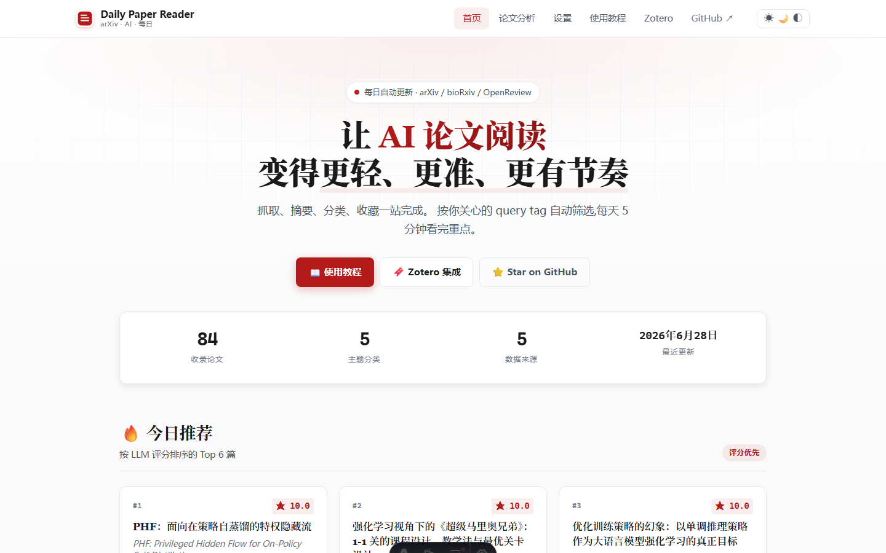
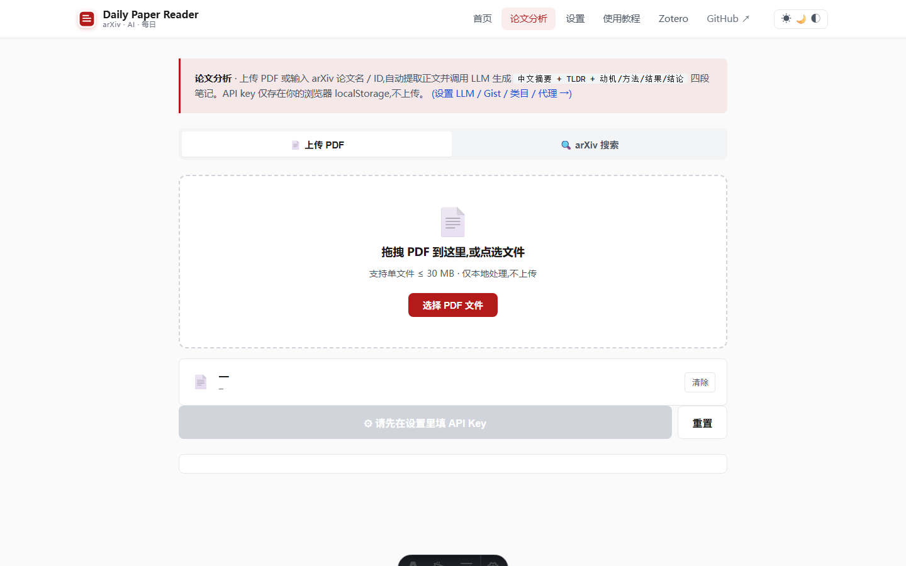
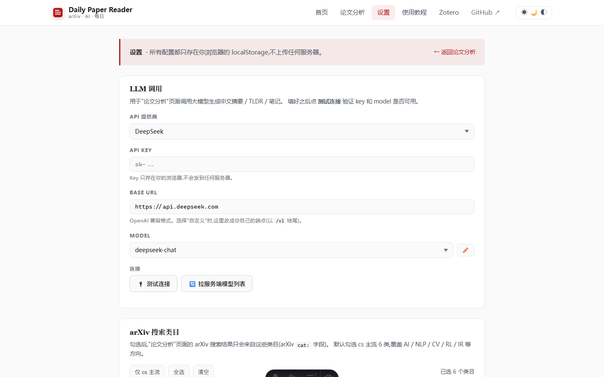
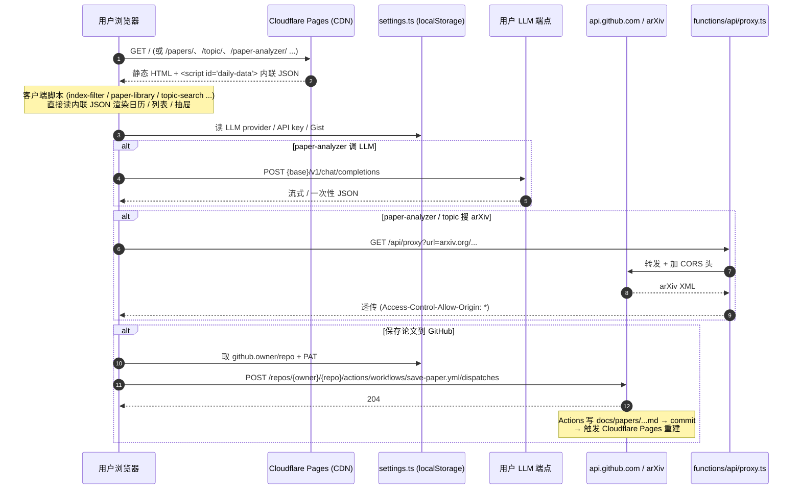

<p align="center">
  
</p>

<h2 align="center">Your Daily Companion for Discovering and Reading AI Papers</h2>

<p align="center">
  <a href="https://github.com/Canyon-netizen/daily-paper-reader/stargazers">
    
  </a>
  <a href="https://github.com/Canyon-netizen/daily-paper-reader/network/members">
    
  </a>
  <a href="https://github.com/Canyon-netizen/daily-paper-reader/blob/main/LICENSE">
    
  </a>
  <a href="https://daily-paper-reader.pages.dev">
    
  </a>
  <a href="#-5-分钟快速启动">
    
  </a>
</p>


## 🖼️ 界面预览
<p align="center">
  
</p>
<p align="center">
  
  
</p>

## 🆕 最近更新

- **2026-07-19** 📅 首页浏览体验升级：新增按发布日期浏览的论文日历，联动年 / 月下拉一次切换一个月份；主题分类统一按 `task` 标签归类，兼容旧版 `query:` tags 并展示每个主题下的全部论文。
- **2026-07-19** 📚 论文库回归检索与整理：移除 cytoscape 相似度网络，改为居中的全量论文列表，保留搜索、标签筛选、详情抽屉、用户标签编辑与隐藏管理。
- **2026-07-19** ☁️ paper-analyzer 新增自动同步：可在 `/settings/` 开启「论文分析 — 自动同步」，arXiv 分析完成后自动触发 `save-paper.yml`，把笔记写入 `docs/papers/<id>-<slug>.md`；默认关闭，手动保存入口继续保留。
- **2026-07-19** 🔄 daily pipeline 从每天一次调整为每 6 小时运行一次（UTC 00:00 / 06:00 / 12:00 / 18:00），并修复文档生成脚本在 GitHub Actions Python 3.11 下的 f-string 语法错误。
- **2026-07-16** 🌐 README 工作流叙述重写：把站点从「daily pipeline + paper-analyzer」单线更新为「**7 个 Astro 页面 + 10 个 GitHub Actions + 本地 8567 后端**」全景。浏览器侧覆盖 `/` `/papers/` `/papers/<slug>/` `/topic/` `/paper-analyzer/` `/conferences/` `/settings/` 7 页；后端侧覆盖 daily / conference-init / 6 类会议 maintain / 3 类多源 maintain / version-refresh / save-paper / reset-content / ci 共 10 个 workflow。
- **2026-07-06** 🧹 仓库结构治理（17 个 commit，群聊式）：删 Docsify 前端 `app/` + 根 `index.html` + 6 个 orphan `tests/test_*.js`；`docs/_plans/` 迁移到仓库根 `plans/` 并抽 `astro-src/lib/paper.ts` 的 `EXCLUDED_DIRS` 常量；`src/*.py` 的 `try/except` 双 import 兜底清理（统一为 package-mode `from src.X import …`）；新增 [`scripts/run-pipeline.sh`](scripts/run-pipeline.sh)（自动激活 venv 的 Python 入口）、[`config.user.yaml.example`](config.user.yaml.example)（fork 用户覆写模板，gitignored）、[`docs/path-spec.md`](docs/path-spec.md)（三套日期目录命名权威规范）、[`tests/README.md`](tests/README.md)（pytest 文件名→`src/*.py` 模块映射）；`.gitignore` 去重 + `.scratch/` 目录级 ignore + `.DS_Store` 治理；`.gitattributes` 给 `docs/**/*.txt` 接 Git LFS；workflow owner allowlist 一致化到 `daily-paper-reader.yml` + `conference-paper-retrieval.yml`；`edge-functions/proxy.ts` + `others/structure.png` 删除。详细规划与每个 commit 的动机 / 风险 / 回滚见仓内 `.claude/plans/compressed-napping-hoare.md`。
- **2026-07-04** 🛠️ 全面改造 `paper-analyzer` 页面：配置项默认自动持久化（input + debounce），新增 **🔌 测试连接** 按钮调用 `GET {base}/v1/models` 验证当前模型与服务端一致，新增 **🔄 刷新模型列表** 从服务端拉取真实模型填入 `<select>` 下拉；切 provider / 模型变更均有提示。
- **2026-07-04** ☁️ 新增 Cloudflare Pages Function 反代：把 `functions/api/proxy.ts` 部署为 Pages Function，浏览器走 `daily-paper-reader.pages.dev/api/proxy?url=...` 拉 arXiv，无需依赖公共代理，0 配置即可用。EdgeOne Pages 用户请自行部署等价反代。
- **2026-07-04** 🔁 GitHub Actions 全面改造：6 个 workflow 改为从 **单一 secret Gist** 拉所有 key（LLM_API_KEY / SUPABASE_SERVICE_KEY / RERANK_* 等），仓库 Settings 只需 2 个 secret：`DPR_GIST_ID` + `DPR_GIST_TOKEN`；daily pipeline 不再因 `LLM_MODEL` secret 缺失直接红。
- **2026-07-04** 🔀 站点迁移 Astro 5：`docsify` → `astro` 静态站，paper-analyzer 客户端组件用 `pdf.js` 抽正文 + 调 LLM，配置 / Gist Token / CORS 代理全存浏览器 `localStorage`，换 token 同步零打扰。
- **2026-05-25** 🎛️ 重构后台管理体验：日常与会议面板统一词条卡片、批量选择、底部操作区与危险操作分区；新增仅会议临时词条，优化候选生成、关键词编辑、最近提问与模型选择弹窗样式。
- **2026-05-25** 🖼️ 优化论文阅读页媒体展示：为 Attention 示例补充图片轮播，并固定轮播展示高度，避免切图时按钮位置跳动。
- **2026-05-24** ⚡ 优化 GitHub Pages 首屏加载：本地化/延迟加载非首屏脚本，移除 Google Fonts 阻塞，并支持 CDN 静态资源加速与失败回退。
- **2026-05-23** 🧠 强化远端模型链路：默认使用 `zwwen` 远端 embedding 与 rerank，补齐 DeepSeek V4 长输出、JSON 截断恢复和前端探活兼容处理。

<details>
<summary>Earlier news</summary>

- **2026-05-22** 🌐 接入公益向量与重排服务：新增 `zwwen.online` embedding / rerank 链路，并让前端 reranker 测试在公益模式下免 API Key。
- **2026-05-21** 🧩 重整本地初始化与模型配置：支持本地 dotenv 调试配置，更新 DeepSeek 默认模型到 V4，并移除旧的柏拉图 / BLT 配置链路。
- **2026-04-08** 🏷️ 推荐状态改为按 tag 独立维护：`carryover` 时间与历史 `seen_ids` 不再跨词条互相污染。
- **2026-03-28** 🧬 补齐多源论文维护链路：新增并打通 `bioRxiv`、`medRxiv`、`ChemRxiv` 以及多类会议论文的抓取、向量编码、Supabase 同步与检索 SQL。
- **2026-03-11** 🛡️ 完善 Supabase 召回与推荐链路：BM25 / exact 增加时间分片与递归细分兜底，Supabase-only 召回改为动态 Top K。
- **2026-02-08** 🔗 支持 Supabase 向量同步，并优先复用用户侧预置 embedding，补齐公开数据同步链路。
- **2026-01-10** 🧱 推荐系统大改版，alias 统一为 tag，召回、排序与 LLM refine 链路拆分成独立步骤。
- **2025-12-31** 🧭 新增统一引导面板，把主要设置集中到同一个入口。
- **2025-12-29** 🌐 项目切换到纯前端架构，订阅、配置与 GitHub Token 管理前置到浏览器端。
- **2025-12-22** 🍴 调整为 Fork 即用版本，进一步降低自部署门槛。
- **2025-12-17** 🌱 最小可运行版本落地，并完成早期 Zotero Connector 集成。

</details>

## ✨ Why Daily Paper Reader?

- **🔎 多源论文雷达**：GitHub Actions 定时抓取 **arXiv / bioRxiv / medRxiv / ChemRxiv / OpenReview 会议**（ICLR / ICML / NeurIPS / ACL / EMNLP / AAAI），覆盖 CS 主流到 q-bio 跨学科。
- **🎯 个性化召回 + LLM 评分**：`subscriptions.intent_profiles` 维护研究方向 tag，BM25 + 向量 + RRF 三路召回，LLM 二次精排出 Top 论文，附带中文摘要与 TLDR。
- **📖 一站式阅读**：首页编辑精选与发布日期日历 → `/papers/` 可搜索 / 筛选的论文库 → 单篇论文详情（摘要 / 速览 / 全文笔记 / **paper-chat 全文模式**）。
- **💡 主题探索 (`/topic/`)**：5 阶段状态机——输入研究思路 → LLM 拆解子方向 → arXiv 检索 → 批量生成中文速览 → 主题报告 + 多轮追问；会话存 `localStorage`，刷新可续。
- **🧪 paper-analyzer 长文精读**：上传 PDF 或输入 arXiv ID，自动抽取正文并生成中文摘要 + TLDR + 动机/方法/结果/结论四段笔记，支持 chunking 应对超大 PDF；arXiv 结果可手动保存，或在设置页开启自动同步到 GitHub。
- **🎛️ 集中配置 (`/settings/`)**：LLM / arXiv 类目 / GitHub PAT / 论文分析自动同步 / 长文精读页数 / 主题列表 / CORS 代理 / 用户标签 / 已隐藏论文 —— 一页管全部；可同步到私有 Gist 让 GitHub Actions 复用。
- **🔁 LLM 配置 0 部署**：Provider / API Key / Base URL / Model 全在浏览器 `localStorage`，**一键同步到 secret Gist**，GitHub Actions 自动拉取。
- **☁️ 0 服务器 + 0 公共代理**：站点可部署到 Cloudflare Pages / Vercel / GitHub Pages / EdgeOne Pages；arXiv CORS 反代走 `functions/api/proxy.ts`（Cloudflare Pages Function），不依赖任何第三方代理。
- **🛠️ Fork-and-Run**：Fork 后仅需 Cloudflare 绑定 + 配置大模型 API Key，即可上线自己的论文主页；想加自己研究方向 tag，改 `config.user.yaml` 即可，不会和 daily workflow 改写 `config.yaml` 冲突。

## 🧭 适用场景

- **🎓 个人论文雷达**：持续追踪自己研究方向的新论文。
- **🧪 实验室论文主页**：沉淀团队关注的论文脉络与阅读结果。
- **📚 日常阅读工作台**：把发现、阅读、问答、总结集中到一个入口。
- **🔬 单论文精读**：把 PDF / arXiv ID 丢进 paper-analyzer，得到中文摘要 + 动机 / 方法 / 结果 / 结论四段笔记 + TLDR，不用打开额外窗口。


## 🌐 站点地图

> 站点是 Astro 5 静态站（`astro-src/pages/`），SSR 阶段从 `docs/` 拉论文元数据，客户端脚本接管交互。GitHub Actions 定时 pipeline 把结果写回 `docs/` 后 commit，下一次 push 触发 Cloudflare Pages 自动构建。

| 路径 | 用途 | 关键客户端脚本 / 数据源 |
|---|---|---|
| `/` | 首页：编辑精选（近 7 天 Top 6）+ 发布日期日历（联动年 / 月切换）+ 按 `task` 标签归类的完整主题列表 + 工作流介绍 + 统计 | `components/DailyCalendar.astro`、`scripts/index-filter.ts`、`scripts/paper-selection.ts`；日历数据 `listPapers({sortBy:'date', dedup:true})`，精选数据 `listPapers({sinceDays:7, sortBy:'score', limit:6})` |
| `/papers/` | 论文库：可搜索 / 按标签筛选的全量列表 + 论文详情抽屉 + 用户标签编辑 / 隐藏管理 | `components/PaperLibrary.astro`；用户标签 / 隐藏论文可同步到 Gist |
| `/papers/<slug>/` | 单篇详情：摘要 + 速览 + 全文笔记 + 图集 + **paper-chat 全文模式**（本地 `.txt` 优先，ar5iv 兜底） | `scripts/paper-chat.ts`、`scripts/paper-fulltext.ts`、`scripts/paper-figures.ts`、`scripts/paper-hide.ts` |
| `/topic/` | 主题探索：5 阶段状态机（思路 → 拆解 → 搜索 → 总结 → 报告）+ 多轮追问；复用 paper-analyzer 的 LLM / arXiv 链路 | `scripts/topic-search.ts`；会话存 `localStorage` |
| `/libraries/` | **文献库**：公共主题库（rl / multi-agent / llm-agent / reasoning / computer-vision 等 7 个硬编码方向）+ 用户自建文献库（`statement` / `rubric` / `anchors` / 入库阈值）；详情页 3 tab：论文 / 概念 / 笔记。三层抽象对照 Polaris [`docs/literature-management.md`](../../Polaris/docs/literature-management.md)，DPR 端权威见 [`docs/library-architecture.md`](docs/library-architecture.md) | `lib/libraries.ts`（公共库）+ `lib/user-libraries/`（用户库 CRUD + commit 漏斗）+ `lib/library/relevance.ts`（LLM 评分）+ `lib/library/graph.ts`（概念图谱）+ `scripts/library-ingest.ts`（arXiv 拉取 + 评分） |
| `/paper-analyzer/` | 长文精读：上传 PDF / arXiv 搜索 / 历史笔记 3 个 tab；走 PDF.js 抽正文 + LLM 4 段笔记 + chunking 应对超大 PDF；arXiv 结果支持手动或自动同步到 GitHub | `scripts/paper-analyzer.ts`（导出 `searchArxiv` / `fetchArxivPdf` / `callLLM` / `SYSTEM_PROMPT`，被 `/topic/` 复用） |
| `/conferences/` | 会议论文拉取：选会议 + 年份 → 调 GitHub REST `workflow_dispatch` 触发 `conference-init.yml` → 轮询 run 状态 | 直接 fetch `api.github.com`；不走本机后端 |
| `/settings/` | 一站式浏览器配置 + Gist 同步：LLM / arXiv 类目 / GitHub PAT / 论文分析自动同步 / 长文精读 / 主题列表 / CORS 代理 / 用户标签 / 已隐藏论文 / 重置 | `scripts/settings.ts`（核心 localStorage 读写中枢，所有页面共用）+ `scripts/settings-page.ts` |
| `/tutorial/` | 使用教程 | — |
| `/zotero-usage/` | Zotero Connector 集成说明 | — |

数据流方向：

- **写入**：`docs/` 是站点唯一真相源。`daily-paper-reader.yml` commit 新论文 → 下次 push 触发 Cloudflare Pages 构建 → 站点刷新。
- **浏览器配置**：全部存 `localStorage`（settings.ts 统一读写），可一键同步到私有 Gist。
- **论文笔记写入**：`/paper-analyzer/` 的 arXiv 分析结果可手动点「📤 保存到 GitHub」，也可在 `/settings/` 开启「论文分析 — 自动同步」；两种方式都会触发 `save-paper.yml`，把笔记写入 `docs/papers/<id>-<slug>.md`。自动同步默认关闭，仅对 arXiv 分析生效，并需要具备仓库 / Actions 写权限的 GitHub PAT。

---

## 🛠️ 开发约定

> 给 fork / 自部署用户的本地开发提示——这里集中说明仓库约定的"哪些目录不该 commit"、"如何运行 pipeline"。

- **临时调试目录** `.scratch/`：本地一次性脚本（`.py` / `.mjs` / `.sh` 都可），已被 `.gitignore` 整目录忽略——不入版本控制。
- **本地运行日志** `.local-runs/`：本地调试后端 [src/local_debug_server.py](src/local_debug_server.py) 写入的运行记录，已 gitignored。
- **锁文件** `bun.lock`（文本格式，bun 1.2+）：当前仓库唯一锁文件。`.lockb` 是早期二进制版本，未启用。
- **`docs/` 三种日期子目录命名**：见 [docs/path-spec.md](docs/path-spec.md)。任何新论文必须按那里的命名约定落盘，否则 Astro 路由会找不到。
- **私有配置覆写**：fork 用户可以把 `subscriptions.intent_profiles`、`github.owner/repo` 等放到 `config.user.yaml`（gitignored 已被 [.gitignore](.gitignore) 排除），与仓库内 [`config.yaml`](config.yaml) **自动 deep-merge**（fork 用户字段优先）。`src/source_config.py:load_config_with_source_migration()` 在迁移 source_backends 之前就 apply overlay。模板见 [`config.user.yaml.example`](config.user.yaml.example)；覆写语义见"🍴 fork 配置工作流"小节。
- **Python 双 import 兜底**：仓库内 `src/*.py` 早期使用 `try: from X ... except: from src.X ...` 双 import 来兼容 script-mode 与 package-mode 两种执行路径。该约定会被 PR #B 清理掉，届时 Python 入口请走 **`scripts/run-pipeline.sh src/main.py ...`**（它会自动激活 venv，并保留当前目录为仓库根），前提是先 `scripts/bootstrap_local.sh` 装好 venv。

> 想更系统地理解"仓库的目录该怎么整理"与"未来治理路线图"，看 [docs/path-spec.md](docs/path-spec.md) 与仓内治理方案 `.claude/plans/compressed-napping-hoare.md`。

---

## 🍴 fork 配置工作流

> 本节描述的工作机制已在代码层落地。`src/source_config.py:load_config_with_source_migration()` 在源迁移之前会自动 deep-merge `config.user.yaml`（如存在），fork 用户的私有字段会覆盖仓库内 `config.yaml` 同名字段。env override 用 `DPR_USER_CONFIG=/abs/path.yml`。`config.user.yaml.example` 仍提供模板。

### 为什么需要 `config.user.yaml`

fork 这个仓库后你大概率会想做这两件事：

1. 改 `subscriptions.intent_profiles`（追踪你感兴趣的研究方向），**每天**；
2. 改 `github.owner` 到你自己的 GitHub handle，让 [`save-paper.yml`](.github/workflows/save-paper.yml) 把论文笔记推到 fork 而不是 upstream。

但 [`config.yaml`](config.yaml) 是被 daily workflow **运行时改写**的（[src/main.py:99-138](src/main.py#L99-L138) 的 `apply_topics_from_gist_env()` 直接 `save_config(config.yaml)`）。这意味着你 fork 后提交的每天改动，**会和你的本地手动修改冲突**，`git pull` 时极容易 reject。

`config.user.yaml` 是解药：你把要覆写的字段写到它，daily workflow 优先读这份私有文件，**仓库内 `config.yaml` 在你 fork 后从头到尾都不需要改**。

### 用法（已生效）

```bash
# 1. 从模板复制
cp config.user.yaml.example config.user.yaml

# 2. 编辑你要覆写的字段
#    （默认所有字段都是注释；逐段取消注释 + 改值即可）

# 3. 确认 git status 干净
git status --short
# 应该看到 ? 表示未追踪（被 .gitignore 排除），不是 M / A
```

可覆写字段（详见 [`config.user.yaml.example`](config.user.yaml.example)）：

| 字段 | 典型用途 |
|---|---|
| `github.owner` / `repo` | fork 用户的 GitHub handle |
| `subscriptions.intent_profiles` | 你的研究方向 tag 列表 |
| `arxiv_paper_setting.days_window` | 9（默认）vs 10+（区间目录） |
| `supabase.url` / `anon_key` | 自部署 Supabase 实例 |

### 不要往里放的字段

- **密钥类**（LLM API key、Gist token、Supabase service_role key）→ 走浏览器 [`localStorage`](astro-src/scripts/settings.ts) 或本地 `.env`（已被 [.gitignore](.gitignore) 排除）。
- **`config.yaml` 已有但你没想覆写**的字段 → 留空，让它继承默认。

### 推荐的 commit 习惯

```bash
git pull --rebase upstream main
# 如果 daily workflow 把 config.yaml 改了（你 fork 早期会撞到），可放心丢弃：
git checkout -- config.yaml
# 你 fork 自己的私人改动（subscriptions.* 等）已落到 config.user.yaml，没丢
```

---

## ⚙️ 架构总览

```
┌──────────────────────── 浏览器 (Astro 5 static) ────────────────────────┐
│                                                                            │
│  / 首页 ──┐                                                                │
│  /papers/ ──┤                                                               │
│  /papers/<slug>/ ──┐   settings.ts (localStorage 中枢)                    │
│  /topic/ ────────┤   ┌────────────────────────────────────────────────┐   │
│  /paper-analyzer/ ┼──►│ LLM Provider / API Key / Base URL / Model      │   │
│  /conferences/ ──┘   │ GitHub PAT / Gist ID / 用户标签 / 隐藏论文       │   │
│                      │ arXiv 类目 / CORS 代理 / 长文精读参数 / 主题列表 │   │
│                      └──────────────┬─────────────────────┬───────────┘   │
│                                     │                     │               │
│                       paper-analyzer / topic 调用       调 GitHub REST    │
│                                     ▼                     ▼               │
│                          /api/proxy?url=...       api.github.com/gists    │
└─────────────────────────────────────┬─────────────────────┬─────────────┘
                                      │                     │
        ┌─────────────────────────────┘                     │
        │                                                    │
Cloudflare Pages Function (/api/proxy)            GitHub Gist (私有 secret)
  转发 arXiv + 加 CORS 头                          注入 LLM_API_KEY /
                                                    SUPABASE_SERVICE_KEY /
                                                    RERANK_* 等 key
        │                                                    │
        └────────────────────┬───────────────────────────────┘
                             ▼
┌────────────────────── GitHub Actions ─────────────────────┐
│                                                              │
│  daily-paper-reader.yml     每 6 小时一次 (UTC 00/06/12/18)   │
│    Load secrets from Gist ─► src/main.py                     │
│      0 enrich queries → 1 fetch arxiv/biorxiv/medrxiv/...    │
│      → 2.1 BM25 召回 → 2.2 embedding 召回 → 2.3 RRF 合并    │
│      → 3 rank → 4 LLM refine + 中文摘要/TLDR/笔记            │
│      → 5 select → 6 generate_docs → docs/                   │
│    自动 commit docs/ + 触发 Cloudflare Pages 重建            │
│                                                              │
│  conference-init.yml        /conferences/ 触发 (workflow_dispatch)│
│    src/maintain/init_<conf>.py → fetch + embed → Supabase    │
│    支持 AAAI / ACL / EMNLP / ICLR / ICML / NeurIPS           │
│                                                              │
│  maintain-biorxiv.yml       每日抓 bioRxiv                    │
│  maintain-chemrxiv.yml      每日抓 ChemRxiv                   │
│  maintain-medrxiv.yml       每日抓 medRxiv                    │
│  maintain-supabase.yml      跨源同步 → Supabase               │
│  maintain-version-refresh.yml 每周一查 arXiv 最新版本 → 重生成 │
│                                                              │
│  save-paper.yml             浏览器触发 → 把论文笔记推到仓库    │
│  reset-content.yml          清空 docs/ 重新初始化              │
│  ci.yml                     PR 检查                            │
└──────────────────────────────────────────────────────────────┘
                             ▲
                             │ (本地调试可选,仅存活检查)
┌──────────────────── scripts/local_debug.sh ────────────────────┐
│  启动 8567 本地后端 (src/local_debug_server.py)                  │
│  /api/local/health ─► {ok, mode, time} JSON                      │
│  P1-6 之后 8567 不再承载 workflow_dispatch;触发 workflow 走      │
│  GitHub UI 或 GitHub REST workflow_dispatch (前端 100% 走        │
│  api.github.com,见 astro-src/pages/conferences/index.astro)。   │
└──────────────────────────────────────────────────────────────────┘
```

每个 workflow 的具体步骤见对应的 `.yml` 文件（[`.github/workflows/`](.github/workflows/)）。补充说明：

- **`daily-paper-reader.yml`** 是站点内容生产的主入口；其余 maintain 系列只往 Supabase 写向量、不写 `docs/`。
  - **P0-1 fetch 失败兜底**：[`src/main.py`](src/main.py) Step 1 外包 try/except `CalledProcessError`——arXiv 抖动时不再让 daily pipeline 直接 exit 1，而是写空 `raw/arxiv_papers_<token>.json` + `raw/fetch_status.json` sentinel（记录 `{status, returncode, stderr_tail, timestamp, run_date_token}`），让后续 BM25/Embedding/RRF 跑空数据、workflow Commit step 把 sentinel 写进 git history。次日 PR review 能看到"前一天 fetch 失败"的可观察信号，而不是 GitHub Actions UI 上一闪而过的红 ❌。
  - **P3-2 拆 commit**："Commit results" step 拆成两个独立 commit——`[chore] daily config snapshot`（`config.yaml` + `docs/config.yaml` + `archive/*state*.json`，反映 fork 用户的本地配置变更）和 `[chore] daily paper pipeline`（`docs/papers/*` + `archive/*/recommend`，内容增量）。git log 区分配置变更 vs 内容增量，review 与 rollback 都更精确。
- **`conference-init.yml`** 由 `/conferences/` 页面前端通过 GitHub REST `workflow_dispatch` 触发，参数 `{conferences, year_end, year_count, skip_fetch}`。**P0-3 修复**：[`astro-src/scripts/conferences.ts`](astro-src/scripts/conferences.ts) 把 `dispatchWorkflow` + `pollRun` 抽成可单元测试模块，pollRun 加 401 / 403 / 其它非 ok 响应分支立即 bail + return，避免 UI 在 GitHub API 限流时 stall 10 分钟。
- **`maintain-version-refresh.yml`**（每周一定时，或手动 `workflow_dispatch`）跑 [`src/maintain/refresh_versions.py`](src/maintain/refresh_versions.py)，扫描 `docs/papers/` 里每篇论文、查询 arXiv 最新版本，落后的自动用 `src/6.generate_docs.py --paper-id` 重生成新版本笔记（精读→全文总结+图，速读→速览），并删除旧版本 `.md`/`.txt`/图目录。支持 `--dry-run` / `--limit` / `--only-id`。

---

## 🌐 网站工作流（site pipeline）

> 「架构总览」一节讲的是 **GitHub Actions** 怎么把论文抓回来、commit 到 `docs/`。这一节讲**站点自身**的工作流：`docs/` 里的 markdown 如何变成用户浏览器里能交互的页面，客户端脚本如何与 LLM / arXiv / GitHub REST 协作。
>
> **两节分工**：
> - 「架构总览」= **CI / 后端 / 调度**（10 个 workflow + 8567 后端）。
> - 本节 = **站点内容消费 + 渲染 + 交互**（构建产物 / SSR / 客户端脚本 / 浏览器配置中枢 / 主题分类 / Gist 闭环）。

### 1. 数据真相源：`docs/`

整个静态站点的"内容侧"由仓库内 4 类文件共同构成，`astro-src/` 的源码只负责把这些文件**读出来**渲染、不会反向改写它们：

| 路径 | 内容 | 谁写入 | 用途 |
|---|---|---|---|
| `docs/papers/YYYY/MM/DD/<arxiv-id>-<slug>.md` | 论文笔记（frontmatter + 速览 4 段 + TLDR + 笔记 body） | [`src/6.generate_docs.py`](src/6.generate_docs.py) | 论文详情页 `[arxiv].astro` 的数据源；命名权威见 [`docs/path-spec.md`](docs/path-spec.md) |
| `docs/papers/<arxiv-id>.txt` | 同一论文的 PDF 全文（Git LFS 跟踪） | daily pipeline + version-refresh | `/papers/<slug>/` 的 paper-chat **全文模式**首选用作 `paper-fulltext.ts` 数据源 |
| `docs/assets/figures/arxiv/<id>/fig-NNN.webp` + `meta.json` | 由 pdffigures2 抽取的论文图 | [`src/maintain/paper_figures.py`](src/maintain/paper_figures.py) | 详情页图集 + 列表页缩略图 |
| `docs/config.yaml` | 推送 / topics / github.owner/repo 等运行时配置 | daily pipeline（`apply_topics_from_gist_env`） | 改方向 / 改仓库 owner 的最简入口 |

frontmatter 里的 `categories: { venue, task, method, type }` 是 4 维分类的"真相源"，与 [`config/taxonomies.json`](config/taxonomies.json) 的白名单**双向互锁**——Python 端写、`astro-src/lib/taxonomies.ts` 端读并按维度上色，旧 `query:` tag 通过 `ALIAS_OLD_TAG_TO_TASK` 自动迁移到新 `task` 标签。

### 2. 构建时：从 markdown 到静态产物

3 个 build-time 步骤在 `bun run dev` / `bun run build` 之前自动跑完（`package.json` 的 `predev` / `prebuild` 钩子）：

| 步骤 | 触发 | 关键脚本 | 产物 | 关键约束 |
|---|---|---|---|---|
| 1. 重建 arxiv 索引 | `predev` / `prebuild` | [`astro-src/scripts/build-arxiv-index.mjs`](astro-src/scripts/build-arxiv-index.mjs) | `public/arxiv-index.json`（`{canonicalId: {rel, title}}`） | 同一论文多版本只保留最高 `v#`，供 `/settings/` 的"已隐藏论文"管理用 |
| 2. 镜像文档资源 | `predev` / `prebuild` | [`astro-src/scripts/copy-docs-assets.mjs`](astro-src/scripts/copy-docs-assets.mjs) | `public/assets/figures/`、`public/assets/tables/`、`public/papers/*.txt` | 多版本 dedup + 24 MiB 单图上限（超了 sharp 自动缩到 4096 px 长边，缺 sharp 时跳过不抛错）；`.txt` 截断到 1 MiB（避开 Cloudflare 单文件 25 MiB 上限） |
| 3. Astro build | `astro build` | [`astro.config.mjs`](astro.config.mjs)（`srcDir: './astro-src'`、`trailingSlash: 'always'`、`format: 'directory'`） | `dist/`（按部署平台分别走 Vercel / Cloudflare Pages / EdgeOne / GitHub Pages） | 部署到子路径（GH Pages）时由 `DEPLOY_BASE` env 注入 `import.meta.env.BASE_URL`；`figureUrlToAbsolute` / navbar `href` / `<base href>` 全部跟随 |

Astro 通过 [`astro-src/lib/paper.ts`](astro-src/lib/paper.ts) 里的 `walk()` 递归 `docs/papers/**/*.md`，跳过 `_` / `tutorial` / `assets` / `plans` 目录；`getStaticPaths` 在 `papers/[arxiv].astro` 列出全部 `params.arxiv = basename`，URL 形如 `/papers/2607.12345v1-starbench-rpg/`。

### 3. SSR：每个页面怎么读 `docs/`

7 个页面、4 种 SSR 形态：

| 路由 | SSR 数据源 | 关键 client 脚本 | 数据传递方式 |
|---|---|---|---|
| `/` | `listPapers({sinceDays:7, sortBy:'score', limit:6})`（精选） + `listPapers({sortBy:'date', dedup:true})`（日历） | [`index-filter.ts`](astro-src/scripts/index-filter.ts) / [`paper-selection.ts`](astro-src/scripts/paper-selection.ts) | `<script id="daily-data">` 内联 JSON；最近一次 Actions 成功 run 日期由 GitHub REST 拉（无 `GH_TOKEN` 时回退最新论文日期） |
| `/papers/` | `listPapers()` 全量（dedup） | [`paper-library.ts`](astro-src/scripts/paper-library.ts) | `<script id="papers-data">` 内联；客户端虚拟滚动 + 标签筛选 + 详情抽屉 |
| `/papers/<slug>/` | `getStaticPaths` + `readPaper()` + `readFulltextInline()` | [`paper-chat.ts`](astro-src/scripts/paper-chat.ts) / [`paper-fulltext.ts`](astro-src/scripts/paper-fulltext.ts) / [`paper-figures.ts`](astro-src/scripts/paper-figures.ts) / [`paper-hide.ts`](astro-src/scripts/paper-hide.ts) | 段落级 `data-*` carrier；全文 `.txt` ≤ 200KB 时 base64 内联到 `<section id="paper-chat">`，否则 client 端 fetch `/papers/<id>.txt` |
| `/topic/` | 无 SSR；5 阶段状态机全 client | [`topic-search.ts`](astro-src/scripts/topic-search.ts) | localStorage 持久化（`dpr_topic_session_v1`，800 KB / session，4 MB 总量上限） |
| `/paper-analyzer/` | 无 SSR；客户端 pdf.js 抽正文 | [`paper-analyzer.ts`](astro-src/scripts/paper-analyzer.ts) | localStorage + 必要时 Gist 同步（`save-paper.yml`） |
| `/conferences/` | 无 SSR；前端直连 GitHub REST | [`conferences.ts`](astro-src/scripts/conferences.ts) | 直接 fetch `api.github.com`（`dispatchWorkflow` + `pollRun`，401/403 立即 bail） |
| `/settings/` | 无 SSR；纯 client 页面 | [`settings.ts`](astro-src/scripts/settings.ts) + [`settings-page.ts`](astro-src/scripts/settings-page.ts) | localStorage 一站读写；同步推送到 Gist |

构建时关键 lib 一览：

- [`astro-src/lib/paper.ts`](astro-src/lib/paper.ts) — `readPaper` / `listPapers` / `dedupByCanonicalArxivId` / `flattenCategories` / `resolveTaskKey`；首页 / 列表 / 详情页全部走它。
- [`astro-src/lib/markdown.ts`](astro-src/lib/markdown.ts) — KaTeX 数学 + GFM 表格 + 详情页与 chat 模式双套渲染（chat 模式自动降级标题层级 + 跳过图集轮播）。
- [`astro-src/lib/taxonomies.ts`](astro-src/lib/taxonomies.ts) — 4 维分类白名单 + `ALIAS_OLD_TAG_TO_TASK` 旧 tag 迁移。
- [`astro-src/lib/venue.ts`](astro-src/lib/venue.ts) — venue 显示名 / 颜色映射。
- [`astro-src/lib/user-tags.ts`](astro-src/lib/user-tags.ts) — 用户自定义 `kind:label` 标签 Gist 同步。
- [`astro-src/lib/llm.ts`](astro-src/lib/llm.ts) — OpenAI 兼容 Chat Completions 的跨 provider 适配；被 paper-analyzer + topic + chat 共享。

### 4. 客户端：用户打开页面后发生什么



**客户端脚本家族**（`astro-src/scripts/`）：

- **设置中枢** [`settings.ts`](astro-src/scripts/settings.ts) — 导出 `STORAGE_KEYS` / `getLLMConfig` / `saveLLMConfig` / `applyTopicUpdates`；**`selection` 类修改必须 emit 事件**（参见 `feedback_settings_selection_must_emit.md`），避免 modal 写 selection 与 settings 写 selection 互相覆盖。
- **paper-analyzer 导出** — `searchArxiv` / `fetchArxivPdf` / `callLLM` / `SYSTEM_PROMPT`，被 **`/topic/` 复用**（参见 `project_topic_explore_refactor.md`）。
- **topic 复用** — `callLLMRaw` / `searchArxivById` / `paper-selection-change`；**不动 settings / paper-selection / paper-analyzer**。
- **paper 全文** [`paper-fulltext.ts`](astro-src/scripts/paper-fulltext.ts) — 本地 `.txt` 优先 + ar5iv 兜底，部署 / 客户端 / gitignore 三处协调（参见 `project_paper_chat_fulltext_source.md`）。
- **paper 关系图（已下线）** [`paper-relations.ts`](astro-src/lib/paper-relations.ts) — 2026-07-19 论文库改版后 cytoscape 图不再挂载，保留 lib 以备复用。

### 5. 主题 / 分类系统如何在浏览器里工作

4 维分类的"真理源 = frontmatter `categories`"：

- **TS 端** [`astro-src/lib/taxonomies.ts`](astro-src/lib/taxonomies.ts) — 4 维白名单 + `ALIAS_OLD_TAG_TO_TASK` 旧 tag 迁移 + 维度颜色（4 套 bg / border 调色板）。
- **Python 端** [`src/taxonomy.py`](src/taxonomy.py) — 写入 LLM refine 结果时按 `taxonomies.json` 白名单过滤。
- **共享配置** [`config/taxonomies.json`](config/taxonomies.json) — TS 通过 Vite JSON import，Python 通过 `json.load` 读，**两边同源**。
- **首页日历** [`DailyCalendar.astro`](astro-src/components/DailyCalendar.astro) — 按 `categories.task[0]` 归类（缺时回退到 `其他`），`TOPIC_LABELS` 维护 key → 中文名映射；`topicCount` 统计**排除 `其他` fallback**，与日历 select 选项数对齐。

主题报告 (`/topic/`) 5 阶段：① 输入研究思路 → ② LLM 拆解 3-5 个 sub-question（可编辑可删）→ ③ 调 arXiv 检索并 AI 预筛到 30 → ④ 批量调 LLM 生成中文速览 → ⑤ 拼装主题报告 + 多轮追问。sub-q 的字段扩展（`extendBalancedJson` / `callLLMRaw`）必须在 3 处白名单同步：`decomposeIdea` + `exploreFromSeeds` + regen handler（参见 `feedback_subq_fields_whitelist.md`）。

### 6. CI / Gist 闭环（轻描）

> "**站点虽然是静态的，但配置是活的**"——浏览器侧的所有用户偏好都通过 Gist 闭环回到 CI 端。


`save-paper.yml` 同理：浏览器 `paper-analyzer` 调 `POST /repos/{owner}/{repo}/actions/workflows/save-paper.yml/dispatches`，由 Actions 把单篇笔记写进 `docs/papers/<id>-<slug>.md`，下一次 push 触发重建。

### 7. 关键设计取舍

- **0 后端 = 0 服务器** — 所有 LLM / arXiv 调用都从浏览器直出；arXiv CORS 靠仓库自带的 [`functions/api/proxy.ts`](functions/api/proxy.ts)（Cloudflare Pages Function）解决，非 Cloudflare 平台用户提供 5 行 Cloudflare Worker 即可等价。
- **`localStorage` 即真相** — 配置不进服务器；用户清浏览器数据 = 回到出厂（页面提示"先同步 Gist"）。
- **4 套部署平台走同一份代码** — `trailingSlash: 'always'` + `format: 'directory'` + `DEPLOY_BASE` env 注入 `import.meta.env.BASE_URL` 保证 Vercel / Cloudflare / EdgeOne / GH Pages URL 一致。
- **CORS 反代必须可用** — Cloudflare Pages 默认 0 配置（`/api/proxy`）；其它平台若反代缺失，paper-analyzer / topic 搜 arXiv 会 0s 挂（参见 `analyzer_arxiv_cors.md`）。
- **`docs/` 是 single source of truth** — 网站从来不"自己生成"内容，全部由 GitHub Actions pipeline 写回；本地 `bun run dev` 只能消费仓库里已有的 `docs/papers/`，要新增内容必须跑 pipeline 或调 `save-paper.yml`。

---

## 🗄️ Supabase schema (`sql/`)

仓库 `sql/` 下的 23 个 `.sql` 是 Supabase 实例的 **DDL 源**——建表 (`create_*_papers_schema.sql`)、检索 RPC (`match_*_papers.sql`)、RLS 策略 (`enable_conference_anon_read_policies.sql`)。

- 这套 DDL **不是** `src/*.py` 自动跑的（pipeline 走 `supabase_source.py`/`sync.py`，假设表已存在）。
- 部署到新 Supabase 实例时需要**手工**在 SQL Editor 里跑一次。`create_papers_schema.sql` + 各自源 schema 是基础；RPC 文件定义 `match_*` 函数，被 `src/2.*.retrieval_papers_*.py` 通过 `SUPABASE_BM25_RPC` / `SUPABASE_VECTOR_RPC` 环境变量调用。
- schema 变更后请同步更新 `sql/`，保持仓库是 source of truth。

---

## 🚀 5 分钟快速启动

> [!TIP]
> 只需准备 **一个大模型 API Key**，配合 paper-analyzer 浏览器或 Gist 同步即可。GitHub PAT 仅当你想把浏览器配置传递到 Actions 时才需要。

### 方式 A：纯 Cloudflare Pages 部署（推荐）

适合个人使用，**全部走 Cloudflare**，无需 EdgeOne / Vercel 配置。

#### 1) 🍴 Fork 本仓库
- Fork 到自己的 GitHub 账号下，建议仓库名保持 `daily-paper-reader` 不变。

#### 2) ▶️ 在 Cloudflare 绑定仓库
- 进入 [Cloudflare Dashboard → Workers & Pages](https://dash.cloudflare.com) → **Create application** → **Pages** 标签 → **Connect to Git** → 选 fork 后的 `daily-paper-reader` 仓库。
- **Build settings**：
  - **Framework preset**：**Astro**
  - **Build command**：`bun run build`（或 `npm run build`）
  - **Build output directory**：`dist`
  - （可选）**Root directory**：留空
- 点 **Save and Deploy**，等待 2-3 分钟，部署成功后 Cloudflare 会分配 `https://<your-project>.pages.dev`。

#### 3) 🌐 访问站点 + arXiv 搜索
- 打开 `https://<your-project>.pages.dev/paper-analyzer/`。
- **arXiv CORS 默认已配置**：站点本身部署了 `functions/api/proxy.ts`（Cloudflare Pages Function），所以**不需要自己部署反代**，搜 arXiv 词即可。
- 如希望换自部署反代，在 LLM 设置最下方 **CORS 代理** 输入框填入 `<your-cors-proxy>/proxy`（留空走内置）。

#### 4) 🔑 在 paper-analyzer 填 LLM 配置
- 点页面顶部 "LLM 设置" 折叠面板。
- 选 Provider（如 DeepSeek / MiniMax / 硅基流动 / 自定义），填 API Key、Base URL、Model。
- 输入即时保存到 `localStorage`（绿色 ✓ "已自动保存到本地浏览器" 提示）。
- 可点 **🔌 测试连接** 验证 API key 是否有效、当前 model 是否存在；点 **🔄 刷新模型列表** 从服务端拉取真实模型填入下拉。
- 想统一管理 arXiv 类目、Gist、长文精读参数、用户标签等更多配置，到 [`/settings/`](#) 一站式管理（paper-analyzer 的"LLM 设置"折叠面板与 `/settings/` 写同一份 `localStorage`，两处互通）。

---

### 方式 B：把 LLM 配置传给 GitHub Actions（可选）

> 如果你只用浏览器直接用 paper-analyzer，**可以跳过整个方式 B**——浏览器使用 LLM API 时直接走前端 fetch，不需要 Actions 帮忙。

如果你希望 **GitHub Actions 跑定时 pipeline 时也用你浏览器里的 LLM 配置**（例如每 6 小时抓 arXiv + 自动 rerank + LLM refine），按下面 3 步走：

#### B1) 创建一个 Gist Token
- 打开 [github.com/settings/tokens](https://github.com/settings/tokens) → **Generate new token (classic)**。
- Note: 填 `dpr-gist`(任意名)。
- **Expiration**: 选 `No expiration` 或 90 天。
- **Scopes**:**只勾 `gist`**。
- 点 **Generate token** → 立刻复制。

> ⚠️ **请勿把 token 字符串贴到对话 / 截图 / 公开场合**。最多只贴前 6 位（`ghp_aBcD...`）作为识别码。

#### B2) 在 paper-analyzer 把配置同步到 Gist
- 仍在 `paper-analyzer` 页面。
- 展开 "**同步配置到 GitHub Gist**" 折叠面板。
- **Gist Token**：粘刚才复制的 token。
- **Gist ID**：**留空**（首次同步会自动创建一个 secret Gist）。
- （可选）展开 "**搜集主题配置**" 折叠面板,逐行编辑要追踪的主题（`tag: 中文说明`），留空则 fallback 到仓库内置 `config.yaml` 的 `intent_profiles`。
- 点 "**同步配置到 Gist**" 按钮。
- 同步成功后 Gist ID 自动写回输入框（形如 `5a8ff17d...32 位 hex`）；同步时当前主题列表会一并写入 Gist 文件的 `topics` 字段（JSON array，每项 `{tag, description, enabled}`）。

#### B3) 在 GitHub repo 加 2 个 secret
仓库 → **Settings** → **Secrets and variables** → **Actions** → **New repository secret**：

| Name | Value |
|---|---|
| `DPR_GIST_ID` | 刚才同步时浏览器自动回填的 Gist ID |
| `DPR_GIST_TOKEN` | 同一个 Gist Token 字符串（粘贴完整值） |

加完后 `daily-paper-reader.yml` workflow 第一次跑，**Load secrets from Gist** step 会用 `DPR_GIST_TOKEN` 拉 Gist 文件，把里面的 `LLM_API_KEY / LLM_BASE_URL / LLM_MODEL / SUPABASE_SERVICE_KEY / RERANK_*` 等注入到后续 step 的 `process env`，`src/4.llm_refine_papers.py` 就有正确的 `LLM_MODEL`，pipeline 跑通。

> 💡 如果你改了 LLM API key，只需在 paper-analyzer 里改完点"同步配置到 Gist"即可，GitHub Actions 下一次跑就用新值。**Token 本身要更新时，只需要在 Settings 里改一次 `DPR_GIST_TOKEN`**。

---

### 方式 C：经典三件套（Vercel + EdgeOne + GitHub Pages）

如果你的部署仍然走 Vercel / EdgeOne Pages / GitHub Pages 三套老路径，参考以下新增：

#### 1) 🍴 Fork 本仓库
#### 2) ▶️ 开启 GitHub Actions
进入你 Fork 的仓库 → [`Actions`](../../actions) → 启用 `daily-paper-reader` workflow。
#### 3) 🌍 开启 GitHub Pages
`Settings → Pages` → Source 选 `Deploy from a branch` → Branch 选 `main` → Folder 选 `/(root)`。等约 1 分钟，站点显示在 `https://<你的用户名>.github.io/daily-paper-reader`。
#### 4) 🔑 准备 PAT + 走方式 B 的 B1-B3
准备 DeepSeek API Key + GitHub PAT（classic，勾 `repo / workflow / gist`）。

> ⚠️ EdgeOne Pages / Cloudflare Pages / Vercel 部署后，**arXiv 反代请用 `functions/api/proxy.ts`**（Cloudflare Pages Function），不要走公共代理（多数已限流）。EdgeOne Pages 用户请自行实现等价反代（仓库内 `edge-functions/proxy.ts` 已在 2026-07-06 删除）。

---

## 🧪 paper-analyzer（论文精读工具）

打开部署后的 `/paper-analyzer/` 即可使用。

### 功能
- **📄 上传 PDF**：拖入本地 PDF，自动抽取正文并生成中文摘要 + TLDR + 动机 / 方法 / 结果 / 结论四段笔记。
- **🔍 arXiv 搜索**：支持按标题 / 作者 / arXiv ID 搜索。
- **🔌 测试连接**：调 `GET {base}/v1/models` 验证 API key 是否能访问当前 model。
- **🔄 刷新模型列表**：从服务端拉真实模型填到下拉，无需手抄。
- **💾 保存到 GitHub**：arXiv 分析结果可手动触发 `save-paper.yml`，写入 `docs/papers/<id>-<slug>.md`。
- **☁️ 自动同步笔记**：在 `/settings/` 开启后，arXiv 分析完成即自动触发同一 workflow；默认关闭，上传本地 PDF 时不触发。
- **☁️ 同步配置到 Gist**：一键把当前 LLM 配置写入私有 secret Gist，GitHub Actions 自动读取（见方式 B）。

### 配置项（全部自动持久化到 localStorage）
| 字段 | 说明 |
|---|---|
| Provider | DeepSeek / 硅基流动 / Kimi / 智谱 / MiniMax / OpenAI / 自定义 |
| API Key | OpenAI 兼容 secret |
| Base URL | OpenAI 兼容 endpoint，如 `https://api.deepseek.com/v1` |
| Model | 兼容 OpenAI Chat Completions 的模型名 |
| CORS 代理 | 自部署 arXiv 反代；留空走内置链 + 项目自带的 `/api/proxy` |

> 💡 上面 4 项只是 paper-analyzer 内"LLM 设置"折叠面板的内容。其它配置（GitHub 仓库 owner/repo/workflow、论文分析自动同步、长文精读最大页数、紧凑模式、arXiv 类目勾选、Gist Token、用户标签同步、已隐藏论文管理、CORS 代理自部署入口）都迁到了 [`/settings/`](#) 页，两个页面读同一份 `localStorage`。

### 自部署反代（推荐 5 行 Cloudflare Worker）

如果站点部署在 Vercel / GitHub Pages 这种无法部署 Pages Function 的环境，arXiv 搜索需要自己的反代。**Cloudflare Worker 5 行代码永久稳定**：

```js
// Cloudflare Worker: arxiv cors proxy
export default {
  async fetch(req) {
    const u = new URL(req.url);
    let target = u.pathname.replace(/^\/proxy\/?/, '');
    if (!target) target = u.searchParams.get('url');
    if (!/^https?:\/\//i.test(target))
      return new Response('missing url', { status: 400 });
    const r = await fetch(target, {
      headers: { 'User-Agent': 'Mozilla/5.0 (cf-worker-proxy/1.0)' },
      redirect: 'follow',
    });
    const h = new Headers(r.headers);
    h.set('Access-Control-Allow-Origin', '*');
    h.set('Access-Control-Allow-Methods', 'GET, POST, OPTIONS');
    h.set('Access-Control-Allow-Headers', '*');
    return new Response(r.body, { status: r.status, headers: h });
  },
};
```

部署完把 `<your-worker>.workers.dev/proxy` 填到 paper-analyzer 的 **CORS 代理** 输入框即可。

---

## 📦 Git LFS（大论文文本缓存）

PR #E 已经把 `docs/**/*.txt`（daily pipeline 写的 PDF 文本缓存）走 Git LFS：仓库里加了一条 `.gitattributes` 规则，从 PR #E 落地之后**新提交**的 `.txt` 自动是 LFS pointer。clone 时 `git lfs pull` 才会拉真实文本。

### 维护者：历史 .txt 文件的回填

`docs/**/*.txt` 现存 ~80 个文件是 PR #E 之前的**普通 git blob**，clone 时仍然按全量大小下载。回填到 LFS 是个**改写 git history**的动作（每个 commit 的 oid 都变）：

```bash
# 在干净的工作区上：
git checkout main
git pull --rebase
git checkout -b lfs-migrate-docs-txt
scripts/migrate-lfs.sh      # 仅迁移 + 写一段安全提示
git push --force-with-lease=refs/heads/lfs-migrate-docs-txt:main
# 然后在 PR 描述里链接到 Discussions 上的 heads-up 帖
```

完整的安全流程在 `scripts/migrate-lfs.sh` 的文件头注释里。

### Fork 用户：clone 后拉 LFS

```bash
git clone <fork-url>
cd daily-paper-reader
git lfs install            # 一次性；之后所有 clone 都自动
git lfs pull               # 把 .txt 的真实文本拉下来
```

如果忘了 `git lfs install`，`.txt` 路径会显示为 LFS 指针文本（"oid: sha256:..."）——它们仍能被 `cat` 读，但 paper-analyzer 抽取正文时会读不到。

### 历史回填完成度自检

```bash
# 已转 LFS 的 .txt 数
git lfs ls-files 'docs/**/*.txt' | wc -l
# 总 tracked .txt 数
git ls-files 'docs/**/*.txt' | wc -l
# 两者相等时表示完成
```

---

## 🧪 本地调试模式

如果你在本机开发，不想点击按钮后触发 GitHub Actions，可以启动本地调试后端：

```bash
scripts/bootstrap_local.sh
```

这个脚本会自动创建 `.venv`、安装远程服务模式依赖、按需从 `.env.example` 生成 `.env`，然后启动本地后端。默认不会下载 `torch` 等重依赖。启动完成后访问：

```text
http://127.0.0.1:8567
```

如果你已经准备好了 Python 环境，也可以只启动后端：

```bash
scripts/local_debug.sh
```

也可以手动指定监听地址和端口：

```bash
python src/local_debug_server.py --host 127.0.0.1 --port 8567
```

> **Tip**：跑 pipeline 入口（`src/main.py` / `src/conference_pipeline.py` 等）走 **`scripts/run-pipeline.sh`** 而不是裸 `python`——它会自动激活 venv，省去手动 `source .venv/bin/activate`。
>
> ```bash
> scripts/run-pipeline.sh src/main.py --fetch-days 9
> ```
>
> 这是 [PR #B](../plans/compressed-napping-hoare.md) 落地前的过渡写法；等 `try/except` 双 import 兜底被清理掉后，裸 `python src/main.py` 会因为找不到 `from src.source_config import ...` 而失败——**`scripts/run-pipeline.sh` 是唯一安全入口**。

如果需要跳过依赖安装，可以使用：

```bash
DPR_SKIP_INSTALL=1 scripts/bootstrap_local.sh
```

如果只想启动并明确跳过依赖安装，也可以使用旧的快速部署模式：

```bash
DPR_INSTALL_MODE=minimal scripts/bootstrap_local.sh
```

如果要一次性安装完整运行依赖，可以使用：

```bash
DPR_INSTALL_MODE=full scripts/bootstrap_local.sh
```

完整依赖模式默认先安装 **CPU 版 PyTorch**，避免普通本机部署时误下载 CUDA 大包。如果你确实需要自定义 PyTorch 源，可以设置：

```bash
DPR_INSTALL_MODE=full DPR_TORCH_INDEX_URL=https://download.pytorch.org/whl/cpu scripts/bootstrap_local.sh
```

> ⚠️ **历史说明**：`scripts/local_debug.sh` 启的 8567 后端曾经提供 `/api/local/workflows/dispatch` 等 endpoint 给浏览器调。2026-07 commit `46b2b74` 把 `/conferences/` 改成 GitHub REST 后，前端不再消费 8567 endpoint；2026-07 P1-6 清理把它们从 `src/local_debug_server.py` 中删除（仅保留 `/api/local/health` 作为存活检查）。`scripts/local_debug.sh` 仍可用，但只对想在 8567 跑存活检查的人有意义——触发 workflow 走 GitHub UI 或 GitHub REST。

---

## 🙏 致谢

Daily Paper Reader 的论文发现、重排与阅读增强链路受益于以下开源项目、模型与服务：

- **[PaperCropper](https://github.com/fake-learn/PaperCropper)**：为论文 PDF 中的图表检测与裁剪提供了重要参考和能力基础，让论文详情页可以更自然地展示图表内容。
- **[BAAI/bge-small-en-v1.5](https://huggingface.co/BAAI/bge-small-en-v1.5)**：作为默认 embedding 模型之一，支撑语义召回、会议论文检索与查询向量复用。
- **[Qwen/Qwen3-Reranker](https://huggingface.co/Qwen)**：作为重排链路的重要开源模型基础，用于提升候选论文排序质量。
- **zwwen.online 公益服务**：提供默认远端 embedding / rerank 接入，降低普通用户本地部署时的模型下载、显存和算力门槛。
- **硅基流动（SiliconFlow）**：提供可选的 rerank API 接入方式，便于在不同模型尺寸和调用预算之间做实验与切换。
- **DeepSeek / OpenAI 兼容 API**：为候选过滤、论文精读摘要与问答等 LLM 环节提供模型能力支持。

## ❓ FAQ

### 💻 需要服务器吗？

不需要。Site 可部署到 Cloudflare Pages / Vercel / GitHub Pages / EdgeOne Pages。

### 🔑 GitHub Token 必须吗？

不必须。**只有当你想让 GitHub Actions 用你浏览器里的 LLM 配置时**，才需要 Gist Token + repo 2 个 secret。纯前端用 paper-analyzer 完全不需要 token。

### ⚙️ 我换了 LLM API key，要怎么同步给 GitHub Actions？

打开 paper-analyzer → 改 API key → 自动保存 → 展开"同步配置到 Gist" → 点同步。GitHub Actions 下次跑就用新值。

### 🤖 为什么我的 Gist Token 在 GitHub settings/tokens 看不到？

GitHub 的 classic token 列表页有 UI 缓存问题。**用 API 列出来最准**：

```bash
curl -H "Authorization: Bearer ghp_your_token" https://api.github.com/user/token
```

只要 API 200 OK，token 就有效。GitHub Actions 报 401 多半是 token 没粘到 repo Secrets。

### 🚀 arXiv 搜索总是失败，怎么办？

你需要在站点配 CORS 反代：
- 如果站点部署在 Cloudflare Pages：项目自带 `functions/api/proxy.ts`，**0 配置**。
- 否则：用上方给的 Cloudflare Worker 5 行代码部署，把 `*.workers.dev/proxy` 填到 paper-analyzer 的 CORS 代理输入框。

### 👨‍🔬 适合实验室或团队一起用吗？

可以。它很适合做实验室公共论文面板，或者作为团队内部的论文发现与阅读入口。

## ⭐ Star History

[](https://star-history.com/#Canyon-netizen/daily-paper-reader&Date)
