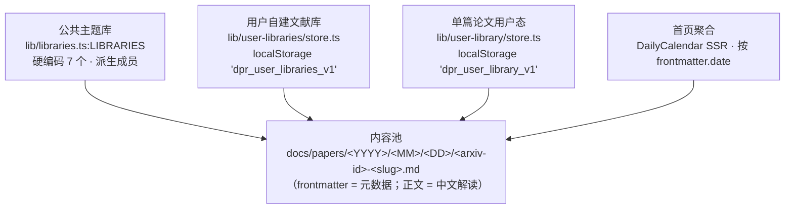

# 文献库架构（Library Architecture）

> **DPR 端的权威架构文档**，对照 Polaris [`docs/literature-management.md`](../../Polaris/docs/literature-management.md)。
> 描述的是 **当前代码事实**（截至 2026-08-11），不是未来计划。任何与代码不一致的地方视为 bug。
>
> **读者**：要修改 `/libraries/` 工作台、`docs/papers/` 入库规则、个人收藏同步、个人笔记回收站的开发者。

DPR 是 **单用户 + 静态站 + IDB / localStorage / Gist 同步**；Polaris 是多用户 + FastAPI + PostgreSQL + 实时协作。两者在"文献库该长什么样"上共享同一份心智模型，但在执行层有不可消弭的差异（见 §8）。本文把"哪里一样、哪里不一样"显式记下来，避免后人按 Polaris 的路径来推 DPR 的实现而走错。

---

## 1. 一张图：三层存储 + 一个聚合入口



**三个关键不变量**（与 Polaris 一致）：

1. **内容只存一份** —— 论文 markdown 只在 `docs/papers/` 下，所有"集合"都是轻量引用（tag / paperId / canonicalArxivId），从不复制正文。
2. **canonical id 不带版本** —— 任何引用论文的 key 都用 `canonicalArxivId()` 去掉 `vN`，避免 v1/v2 各存一份。
3. **单一写入漏斗** —— `user-libraries` 与 `user-library` 各自有一个 `commit()` 漏斗统一盖 `updatedAt` 并发自定义事件；绕开漏斗的写入会让 UI 计数不刷新（[教训](feedback_settings_selection_must_emit.md)）。

---

## 2. 单一内容池 — `docs/papers/<YYYY>/<MM>/<DD>/`

完整路径规范见 [`docs/path-spec.md`](path-spec.md)。这里只重复与文献库架构相关的部分：

- `YYYY/MM/DD` 来自 markdown frontmatter 的 `date: YYYY-MM-DD`，**不是** arxiv id 的 YYMM（commit `3166d40` 修正历史 bug）。
- 文件名 `<arxiv-id>-<slug>.md` 中的 `<arxiv-id>` 可带版本，但所有上层引用都用 canonical 形式。
- 同 ID 多版本只保留最高版本（`v` 越大越新）；`astro-src/scripts/build-arxiv-index.mjs` 自动维护别名。

> 内容池对应 Polaris 的 `papers` 表（PostgreSQL 单表）。Polaris 还有 `pdf_path` / `full_text_path` / `figures` / `tldr` / `paper_vectors` 等列；DPR 把它们全部拍平成 frontmatter + 同名 `.txt` + `assets/figures/arxiv/<id>/` 文件夹。**没有 row-level vector**，相关度由 LLM 离线打分写入 frontmatter 的 `score` / `tldr` / `evidence`。

---

## 3. 四个轻量引用集合

### 3.1 公共主题库 — `astro-src/lib/libraries.ts`

这是 DPR 最接近 Polaris `direction_libraries` 表（公共方向库）的对应物，但实现最简单：

| 项 | DPR 现状 |
|---|---|
| 数量 | **硬编码 7 个**（`rl` / `multi-agent` / `game-ai` / `llm-agent` / `reasoning` / `robotics` / `computer-vision`），加新库要改源码 + commit |
| 成员关系 | **派生**：每库 `tags: ['task:rl']` 这种 dim:label 形式，`lib/paper-filter.ts:filterByTag(items, 'task:rl')` 过滤 |
| 用户态 | **不存任何用户态** —— 公共库是只读浏览面，没有 star / note / trash |
| 评分 | 论文 frontmatter `score` 字段（pipeline LLM 离线生成） |
| Trash | **没有** |
| 入口 | `/libraries/`（卡片流）+ `/libraries/<id>/`（工作台：论文 + 概念 + 摘要 + chat + 重复检测） |

**为什么不存用户态**：DPR 是单人站，"公共"=所有人看同一份 docs/papers，star / note 应该走 `user-library`（§3.3）而不是公共库本身。

### 3.2 用户自建文献库 — `astro-src/lib/user-libraries/`

这是 DPR **最像 Polaris `direction_libraries` 的对应物**：用户命名的论文集合，带方向声明 / rubric / 锚点 / 候选状态机 / 概念覆盖。

| 项 | DPR 现状 |
|---|---|
| 存储 | `localStorage['dpr_user_libraries_v1']`（也 Gist 备份，序列化见 `gist.ts`） |
| Schema | `UserLibrariesDoc`（`schemaVersion: 4`），`libraries: Record<libraryId, UserLibrary>` |
| 字段对照 | 见 §4 数据模型对照表 |
| 候选状态 | `LibraryPaperStatus`（5 态）：`candidate`（LLM 未打分，刚被 ingest 拉进来）→ `scored`（LLM 已打分，等用户确认）→ `included`（用户接受 / 原本就在 `paperIds[]`）/ `excluded`（用户 / 打分剔除）；`trashed` 是回收站软标记（与 `excluded` 区别：`trashed` 仍计入 library_papers，GC 不会回收；`excluded` 同样保留 membership 不会被 GC） |
| visibility | `'personal'` / `'pending'` / `'public'` —— DPR 单人站无 admin，'public' 等同于 Gist 公开 |
| 关键 API | `createLibrary` / `addPaperToLibrary` / `bulkAddPapersToLibrary` / `bulkSetPaperStatus` / `setLibraryVisibility` / `addLibraryAnchor` / `setLibraryConceptOverride` / `getLibraryConceptDisplay` |
| 活动日志 | `activity-log.ts` —— 用户 add / remove / status change 等动作留痕 |
| Trash | 通过 `papers[id].status === 'excluded'` 实现（不是单独的 trash 表）；`trashReason` 字段记录 `irrelevant` / `manual` / `duplicate` 等 |
| 入库流程 | `astro-src/scripts/library-ingest.ts` —— arXiv listing → LLM 评分（`scorePaperRelevance` in `lib/library/relevance.ts`）→ `persistCandidatesAsCandidate` / `commitCandidateAsIncluded` |
| 摘要 | `astro-src/scripts/library-digest.ts` —— `LibraryDigest` 含 paperCount / conceptCount / latestDate / recentIds，缓存到 `data/library-digests/<libId>/<date>.json` |

### 3.3 单篇论文用户态 — `astro-src/lib/user-library/`

这是"个人图书馆"狭义理解下的核心：每篇论文的 star / readingStatus / note / trash / 评分结果，**稀疏**存储。

| 项 | DPR 现状 |
|---|---|
| 存储 | `localStorage['dpr_user_library_v1']`（也 Gist 备份） |
| Schema | `UserLibraryDoc`（`schemaVersion: 2`），`papers: Record<canonicalArxivId, UserPaperState>` |
| `UserPaperState` 字段 | `starred` / `readingStatus`（`'unread' \| 'reading' \| 'read'`）/ `note`（markdown 原文）/ `trash`（`TrashMeta`）/ v2 新增 `relevanceScore` / `tldr` / `concepts` |
| 关键 API | `setStarred` / `toggleStar` / `setReadingStatus` / `setUserNote` / `softDelete` / `restoreFromTrash` / `purgeUserPaperState` / `listStarred` / `listWithNotes` / `listTrashed` |
| 高亮 | `lib/user-library/highlights.ts` —— 论文内文本高亮 + 笔记 |
| Gist 合并 | `mergeUserLibrary`（last-write-wins 按 `updatedAt`；冲突数必须暴露给 UI） |
| Trash | `softDelete(rawId, reason)` —— 写入 `UserPaperState.trash = { deletedAt, reason }`；`restoreFromTrash` 清掉 trash 元数据，其它字段原样保留；`purgeUserPaperState` 彻底删除 |

### 3.4 首页 Daily feed — DailyCalendar

**不是存储**，是聚合视图：

- `astro-src/components/DailyCalendar.astro` + `astro-src/styles/daily-calendar.css`。
- 数据源：`listPapers({ sortBy: 'date', dedup: true })`，SSR 阶段聚合。
- 分桶：按 `frontmatter.date`（发表日）分到 `YYYY/MM` 栅格，同日多篇并入一格。
- 多版本：自动取最高版本（`v` 越大越新）。
- 与 Polaris 的差异：Polaris 的 daily_feed_entries 是 `daily_feed_sync` 后台任务 + 7 天滚动窗口 + 入库入口；DPR 的 DailyCalendar 是只读视图，没有"收藏到库"按钮（收藏走 `/papers/<id>/` 单页的"加入库"按钮）。

---

## 4. 数据模型对照表（Polaris → DPR）

| Polaris 列 / 字段 | DPR 对应 | 备注 |
|---|---|---|
| `papers.id` | `Paper.id = 'papers/<YYYY>/<MM>/<DD>/<basename>'` | DPR 用路径当 id |
| `papers.dedup_key` | `canonicalArxivId(id)` 派生 | DPR 没有列，函数派生 |
| `papers.arxiv_id` | frontmatter `arxiv` 字段 | markdown YAML |
| `papers.title` | frontmatter `title` | |
| `papers.authors` / `affiliations` | frontmatter `authors`（数组） | |
| `papers.abstract` | frontmatter `abstract` | |
| `papers.tldr` | frontmatter `tldr`（中文一句话） | LLM 离线生成 |
| `papers.relevance_score` | frontmatter `score`（0-1，commit `1ceab8bc` 归一化） | 不是 pool-wide，是 pipeline 给的 |
| `paper_wikis.content` | markdown 正文（去掉 frontmatter） | 一篇论文 = 一份 wiki，平台共享 |
| `paper_concepts` 链接 | frontmatter `concepts: [slug, ...]` + `assets/concepts/<slug>.md` | 概念页跨论文共享 |
| `direction_libraries.*` | `LIBRARIES[]`（公共，3.1）+ `UserLibrary`（私有，3.2） | DPR 拆成两个表 |
| `direction_libraries.is_public` | `UserLibrary.visibility = 'personal' \| 'pending' \| 'public'` | 单人站无 admin |
| `direction_libraries.definition`（JSONB） | `UserLibrary.definition: LibraryDefinition`（含 statement / cadence / anchors / keywords / rubric / goals / inScope / outOfScope / questions / relevanceThreshold） | DPR 拍平成 JSON 字段而非 JSONB 列 |
| `library_papers.*` | `UserLibrary.papers: Record<canonicalArxivId, LibraryPaperMeta>` | 含 status / relevanceScore / relevanceReason / tldrNote / trashReason / updatedAt |
| `library_papers.status` | `LibraryPaperStatus`: `'candidate' \| 'scored' \| 'included' \| 'excluded' \| 'trashed'` | 5 态机；Polaris 5 态 + DPR 多了 `trashed` 软删 |
| `library_papers.trash_reason` | `LibraryPaperMeta.trashReason?: string` | 与 status 联动 |
| `paper_tags` + `paper_tag_links` | frontmatter `tags`（LLM 生成 + 人工） | DPR 没有 library 维度的 tag（休眠中，参 Polaris 文档） |
| `user_paper_tags` | `dpr_user_tags_v1`（在 `scripts/settings.ts` 管理） | 跨论文全局 |
| `user_library_entries.*` | `UserLibraryDoc.papers[canonicalArxivId]`（3.3） | star / status / note / trash 合并 |
| `user_library_entries.trashed_at` | `UserPaperState.trash.deletedAt` | epoch ms |
| `daily_feed_entries.*` | 无表，DailyCalendar SSR 派生 | 只读视图 |

---

## 5. 论文生命周期

DPR 没有后台任务，所有步骤在 Actions cron + 浏览器里串起来。

```text
arXiv 每日 listing  (pipeline/src/3.fetch_arxiv.py)
  → LLM 精读 / 速读评分  (pipeline/src/5-7.*.py)
    → 中文解读 markdown + frontmatter  (src/6.generate_docs.py)
      → docs/papers/<YYYY>/<MM>/<DD>/<arxiv-id>-<slug>.md
        → build-arxiv-index.mjs 维护 arxiv-index.json 别名
          → astro build → 静态站
            → 用户在浏览器 add 到 user-libraries / user-library
              → Gist 备份（可选）
```

**步骤幂等性**：

- 同 ID 多版本：`build-arxiv-index.mjs` 自动按 canonical id 分组，最高版本路径生效，其他版本做别名。
- 用户 add 同一篇：去重键 `canonicalArxivId`，已存在的 paperId 不重复 push。
- Gist 合并：`mergeUserLibrary` / `mergeUserLibraries` 按 `updatedAt` last-write-wins；冲突数必须返回给 UI。

**没有做的**（与 Polaris 差异）：

- 论文级 embedding / chunk embedding / pgvector 检索 —— DPR 是静态站 + frontmatter 全文搜索。
- 概念全局 `concepts.slug` 唯一键 —— DPR 有 `assets/concepts/<slug>.md` 但没有唯一约束，靠文件名约定。
- 后台 ingest / scoring / fetch / compile 多步编排 —— DPR 全在 cron pipeline 一把梭。

---

## 6. Tag 系统

DPR 的 tag 比 Polaris 简单得多，因为没有 library 维度 vs user 维度 的两套表：

| 维度 | 来源 | 用途 |
|---|---|---|
| 论文 tag（`task:*` / `method:*`） | frontmatter `tags`，LLM 离线生成 | 公共库成员派生（§3.1）、`/papers/` 过滤 |
| 概念 tag（`concept:slug`） | frontmatter `concepts` + `assets/concepts/<slug>.md` | 概念图谱（`lib/library/graph.ts`）、概念合并 UI |
| 用户自建库 inclusion / exclusion | `UserLibrary.definition.keywords.include/exclude` | `library-ingest` 拉候选时机械过滤 |
| 用户 tag | `dpr_user_tags_v1`（在 `scripts/settings.ts`） | 工作台筛选 `my_tag` 参数；与 Polaris `user_paper_tags` 对齐 |

**DPR 没有 library 维度的 `paper_tag_links`**（Polaris 表休眠中）。如果你需要"在这个库里给论文打 tag"，目前要写到 `UserLibrary.papers[id]` 的 `LibraryPaperMeta` 里，schema 还没为这个字段预留 —— 见 TODO §6 跟进项。

---

## 7. Trash

DPR 三个集合的 trash 实现分别对应 Polaris 的三种：

| 集合 | DPR 实现 | Polaris 对应 | 端点 |
|---|---|---|---|
| 公共库 | **无 trash**（不可编辑） | — | — |
| `user-libraries` | `LibraryPaperMeta.status = 'excluded'` + `trashReason` | `library_papers.status='excluded'` + `trash_reason` | `bulkSetPaperStatus(id, ['excluded'], reason)` |
| `user-library` | `UserPaperState.trash = TrashMeta`（`deletedAt` + `reason`） | `user_library_entries.trashed_at` + `saved=False` | `softDelete(id, reason)` / `restoreFromTrash(id)` / `purgeUserPaperState(id)` |
| Daily feed | 无 trash，7 天滚动窗口（Polaris）；DPR 无窗口，按月聚合 | Polaris `daily_feed_entries` 过期 | — |

**与 Polaris 的一致点**：trashed 状态不删除用户态元数据，只是软标记；`restoreFromTrash` 清掉 trash 字段，其它原样保留。`purgeUserPaperState` 才是真删。

**与 Polaris 的差异**：

- DPR 没有 `gc_orphan_papers` —— 论文物理文件由 cron pipeline 维护，与用户态解耦。
- DPR 没有 `daily_feed_sync` 过期清理 —— Daily feed 是只读视图。

---

## 8. 与 Polaris 的明确差异

承认差距，避免后人按 Polaris 推 DPR。每行末尾标"代码侧 / 文档侧"。

| # | 差异 | Polaris | DPR | 来源 |
|---|---|---|---|---|
| 1 | **多用户 RBAC** | admin / creator / curator 三身份 | 单用户，'public' 仅控制 Gist 公开 | 文档侧（不可消除） |
| 2 | **后台 ingest 任务编排** | `wiki_bootstrap` / `wiki_ingest` Voyage | cron pipeline 一把梭（`src/3-7.*.py`） | 架构侧 |
| 3 | **论文级向量检索** | pgvector + `paper_vectors` | 无；全文检索靠 Astro pagefind + frontmatter 全文搜索 | 架构侧 |
| 4 | **chunk embedding** | `paper_chunk_vectors` | 无 | 架构侧 |
| 5 | **`library_papers` 状态机** | candidate → scored/excluded → fetched → compiled | DPR 也是 5 态 (`candidate → scored → included/excluded` + `trashed` 软删)，但 LLM 评分与 commit 在前端跑而非后台任务 | 一致 |
| 6 | **`wiki_compile` 共享 wiki** | 每篇论文一份 `paper_wikis`，所有库共享 | 已经是每篇论文一份 markdown，天然共享 | 一致 |
| 7 | **概念全局唯一 slug** | `concepts.slug` UNIQUE | `assets/concepts/<slug>.md` 文件名约定，靠人不出错 | 文档侧 |
| 8 | **`library.compile` prompt pack** | skill 系统 + manifest.json | 无；digest 用硬编码 prompt（`SCORE_SYSTEM_PROMPT`） | 代码侧（TODO） |
| 9 | **`getSourceLibraries` 多对多** | `topic_source_libraries` 关联表 | DPR Topic 无独立表，主题是 `/topic/` 路由 | 架构侧 |
| 10 | **`get_library_for_project` 兜底解析** | topic → origin library → 首关联 → None | DPR 不存在此链路 | 架构侧 |
| 11 | **`affiliation_extraction_mode` 配置** | on_add / on_compile / off 三档 | frontmatter 离线生成，没有模式开关 | 架构侧 |
| 12 | **library tag UI** | 休眠但 API 在 | DPR 无 library tag 表 / UI（概念 tag 走 `assets/concepts/`） | 一致 |
| 13 | **daily_feed 过期清理 + 收藏入库** | 7 天滚动 + collect API | DailyCalendar 只读，收藏走单页"加入库"按钮 | 简化 |

---

## 9. 相关文件索引

### 内容池

- `docs/path-spec.md` — 路径规范（YYYY/MM/DD 派生、文件名、迁移工具）
- `astro-src/lib/paper.ts` — `Paper.id` 派生、walk() 扫描
- `astro-src/lib/paper-frontmatter/` — frontmatter 解析（Phase F 抽离）
- `astro-src/lib/paper-note/` — body 渲染（Phase F 抽离）
- `astro-src/scripts/build-arxiv-index.mjs` — 多版本别名

### 公共主题库（§3.1）

- `astro-src/lib/libraries.ts` — `LIBRARIES[]` + `buildLibraryDigests`
- `astro-src/lib/library/relevance.ts` — LLM 评分
- `astro-src/lib/library/graph.ts` — 概念图谱
- `astro-src/lib/library-duplicates.ts` — 版本簇 / 跨 ID 标题重复
- `astro-src/pages/libraries/index.astro`、`[id].astro`

### 用户自建文献库（§3.2）

- `astro-src/lib/user-libraries/types.ts` — `UserLibrary` / `LibraryDefinition` / `LibraryPaperMeta` / `LibraryConceptOverride`
- `astro-src/lib/user-libraries/store.ts` — IDB / localStorage CRUD + commit 漏斗
- `astro-src/lib/user-libraries/activity-log.ts` — 活动日志
- `astro-src/lib/user-libraries/gist.ts` — Gist 序列化 / 反序列化 / 合并
- `astro-src/scripts/library-ingest.ts` — arXiv listing + LLM 评分
- `astro-src/scripts/library-digest.ts` — `LibraryDigest` 生成 + 缓存
- `astro-src/scripts/user-libraries-ui.ts` — 渲染个人库详情面板

### 单篇论文用户态（§3.3）

- `astro-src/lib/user-library/types.ts` — `UserPaperState` / `UserLibraryDoc` / `UserLibrarySnapshot`
- `astro-src/lib/user-library/store.ts` — CRUD + softDelete / restore / purge
- `astro-src/lib/user-library/highlights.ts` — 文本高亮 + 笔记
- `astro-src/lib/user-library/snapshot.ts` — 快照
- `astro-src/lib/user-library/gist.ts` — Gist 序列化 / 反序列化

### 索引与历史

- `docs/migration-polaris-absorption.md` §"文献库架构" — 历史脉络（本文件是其权威化结果）
- `docs/TODO-future-work.md` §6 — Polaris 能力对照表
- `docs/concepts-system.md` — 概念子系统说明（候选门控、7 类别、跨库共享等）
